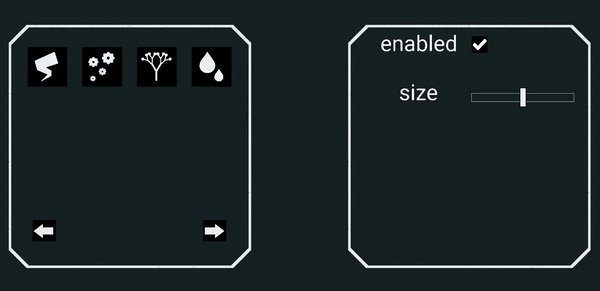
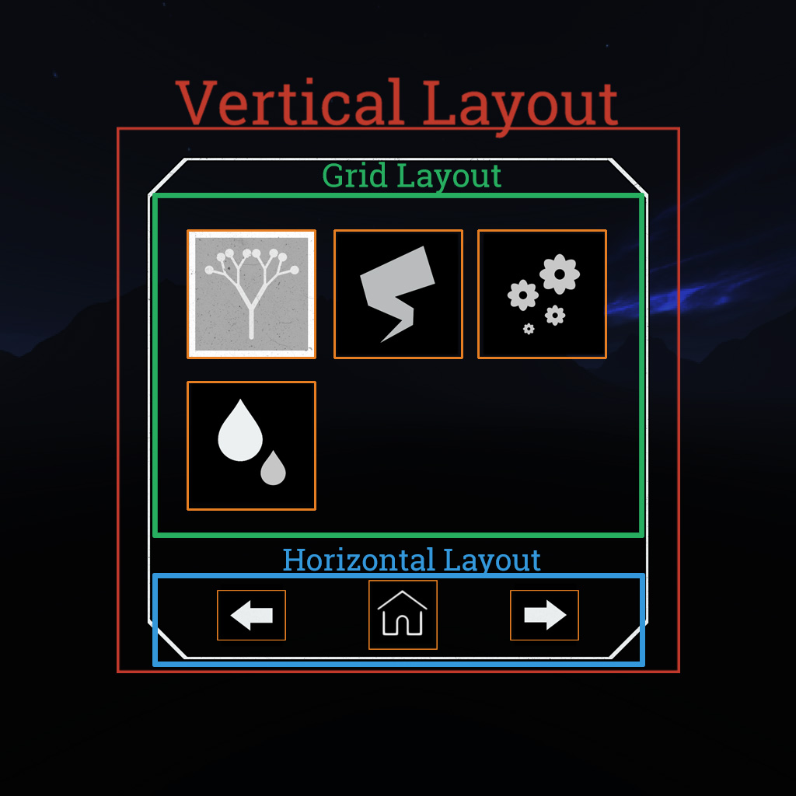

# vr-ui
Simple &amp; flexible 3D user interface.

<p align="center">
  
</p>

**VRUI** is a highly customizable GUI, working in *VR* and *non-VR*. It is based upon Three.js, and makes use of the scene-graph to create its hierarchy.

**VRUI** is greatly influenced by [dat.gui](https://github.com/dataarts/dat.gui), and [dat.guiVR](https://github.com/dataarts/dat.guiVR).

## Features

### Multiple layouts

As stated above, the UI support several layout, that can be combined together, such as the **Horizontal Layout**, **Vertical Layout**, or the **Grid Layout**.

### Pages

For now, we support multiple pages, but without animation when changing from one to another (this will be out soon). Pages can also be created when the previous one is full, if you specify so.

<p align="center">
  
</p>

### Object3D as an input

You can use any **THREE.Object3D** element as an input, by just calling `VRUI.addInput()`


## How it works

**VRUI** works on the same principle as the [Android Layout System](https://developer.android.com/guide/topics/ui/declaring-layout.html), allowing to create a very large number of different interfaces. You can use *layouts* (grid, linear, ...) in which you insert *views* (slider, checkbox, button, ...).

Every views added to the GUI is scaled and positionned relative to its parent. Example:
<p align="center">
  
</p>

To get more information, you can consult the [wiki](https://github.com/artflow-vr/vr-ui/wiki), or the multiple [examples](https://github.com/artflow-vr/vr-ui/tree/master/examples).

### UI Element

Every UI elements (layouts, views, ...) are createad like this:
```javascript
let element = new Element(data, style);
```

with `data` an **Object** of properties containing view or layout relative data. For instance:
```javascript
let layout = new VRUI.layout.GridLayout({
    columns : 4,
    rows: 3
}, {
    background: 0x2c3e50
});
```
Here, we create a **GridLayout**, with **4** columns and **3** rows (this data are only available in **GridLayout**), and with only a **background** property as a style.

## Examples

### Horizontal layout

```javascript
let layout = new VRUI.layout.HorizontalLayout({
    height: 0.1,
    margin: {
        bottom: 0.1
    }
});

let button = new VRUI.view.ImageButton(arrowLeftTexture, {
    width: 0.1,
    background: 0xFF0000,
    position: 'left',
    padding: {
        top: 0.08,
        bottom: 0.08,
    },
    background: backgroundTexture
});

let text = new VRUI.view.TextView({
    string: 'my string!',
    color: 0xFFFFFF
}, {
    height: 0.7,
    position:'right',
});

layout.add(button, text);

let guiWidth = 0.5; // In Three.js units.
let guiHeight = 0.5; // In Three.js units.

let gui = new VRUI.VRUI(layout, guiWidth, guiHeight);
gui.addToScene(scene); // Supposing 'scene' exist and is a THREE.Scene
gui.refresh(); // Recompute the bounds of the UI.

```

## Build

You can use either [npm](https://www.npmjs.com/) or [yarn](https://www.npmjs.com/):

### Build a development version
```sh
yarn install
yarn build
```

### Build a production version
Change the file `.env`, by assigning the `WEBPACK_CONFIG` variable the value `build`.
Then, you can build normally:
```sh
yarn install
yarn build
```

## Contributing

I am currently working on my master's degree and I do not have a lot of free time at this moment. Contributions are highly appreciated. Having the chance to have contributors bring their ideas to improve the library, by adding new features or by changing the **API** would be great!

In a nutshell, do not hesitate!

## TODO

* API
    * [ ] Remove `color` extra data, and add it as a style property
    * [ ] Add helper to create in few lines a datgui like UI
    * [ ] Add getters / setters to element, and ImageButton to simplify usage
    * [ ] Add method to show/hide UI in the VRUI class
    * [ ] Move VRUI data to Three.js userData object. Inheriting from Object3D is also a possibility.
    * [ ] Removes duplicate list by only using Three.js group (this is linked to the TODO just above)

* Features
    * [ ] Add style to clone method to simplify element cloning with style changes
    * [ ] Add animation
    * [ ] Allow different meshes to be used with ImageButton, Slider, etc... This would allow to add meshes with particular form and UVs
    
* Bugs
    * [ ] Aligning / positionniong are wrongly computed in layouts. /!\ Should be fixed quickly
    * [ ] Padding does not seam to work with ImageButton
    
* Others
    * [ ] Improve the `refresh()` method in all layouts. It is sometimes very gross, and has been made quickly!
    * [ ] Add tests 
